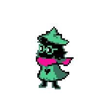
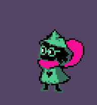
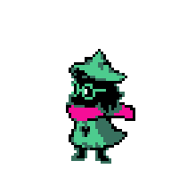

# Ральзей / Ralsei — Codex Pet

Анимированный Ральзей в зелёной шляпе из **Deltarune** для питомцев Codex. Собран покадрово из оригинальных спрайтов глав 1–2: пиксельная графика, розовый шарф, круглые очки и прозрачный фон.

  

## Что внутри

- Зеркальная версия персонажа.
- При наведении Ральзей поднимает шляпу и возвращается в обычную позу; ступни остаются на месте.
- Девять состояний, 57 кадров. Остальные анимации сохранены.
- Исходные спрайты увеличены ровно в 3 раза без сглаживания и перерисовки.

## Установка в Codex

Понадобится настольное приложение с поддержкой питомцев и формата спрайтов v1.

1. Скопируйте всю ссылку ниже в адресную строку браузера и откройте её.
2. Разрешите открыть Codex и завершите установку питомца.
3. Выберите **Ральзей** в разделе питомцев. Для показа или скрытия используйте `/pet`.

```text
codex://pets/install?name=%D0%A0%D0%B0%D0%BB%D1%8C%D0%B7%D0%B5%D0%B9&imageUrl=https%3A%2F%2Fraw.githubusercontent.com%2Fwilberods-coder%2Fralsei-codex-pet%2Fmain%2FRalsei-pet.png&description=%D0%A0%D0%B0%D0%BB%D1%8C%D0%B7%D0%B5%D0%B9+%D0%B2+%D0%B7%D0%B5%D0%BB%D1%91%D0%BD%D0%BE%D0%B9+%D1%88%D0%BB%D1%8F%D0%BF%D0%B5.+%D0%9E%D1%80%D0%B8%D0%B3%D0%B8%D0%BD%D0%B0%D0%BB%D1%8C%D0%BD%D1%8B%D0%B5+%D1%81%D0%BF%D1%80%D0%B0%D0%B9%D1%82%D1%8B%3B+%D0%BF%D1%80%D0%B8+%D0%BD%D0%B0%D0%B2%D0%B5%D0%B4%D0%B5%D0%BD%D0%B8%D0%B8+%D0%BF%D0%BE%D0%B4%D0%BD%D0%B8%D0%BC%D0%B0%D0%B5%D1%82+%D1%88%D0%BB%D1%8F%D0%BF%D1%83.&spriteVersionNumber=1
```

Если браузер не открывает ссылку, скачайте [install.html](https://raw.githubusercontent.com/wilberods-coder/ralsei-codex-pet/main/install.html), откройте сохранённый файл в браузере и нажмите **Установить Ральзея**. Эта страница только открывает штатную установку через `codex://`; никаких скриптов она не запускает.

Для ручного переноса: [скачать Ralsei-pet.png](https://raw.githubusercontent.com/wilberods-coder/ralsei-codex-pet/main/Ralsei-pet.png). Сохраните именно PNG, без изменения размера или конвертации. В приложении с функцией **Upload pet / Загрузить питомца** выберите этот файл; если такой кнопки нет, используйте ссылку установки выше.

Отображением питомца и запуском состояний управляет приложение. PNG содержит только кадры. GIF-файлы ниже служат превью; скорость в приложении может отличаться.

## Формат

| Параметр | Значение |
| --- | --- |
| Файл | `Ralsei-pet.png` |
| Формат | PNG, RGBA, прозрачный фон |
| Размер листа | 1536 × 1872 |
| Ячейка | 192 × 208 |
| Сетка | 8 столбцов × 9 строк |
| Версия | v1 |
| Кадры по строкам | 6, 8, 8, 4, 5, 8, 6, 6, 6 |

Пятая строка — слот `jumping`: здесь он намеренно содержит поднятие шляпы для реакции на наведение. Порядок кадров сохранён при отражении; строки движения вправо и влево переставлены для сохранения направления.

[Контактный лист](previews/contact-sheet.png) · [Метаданные](sprite.json) · [Контрольные суммы](SHA256SUMS)

## English

An animated, hat-wearing **Ralsei from Deltarune** for Codex pets. Uses original Chapter 1–2 sprite frames with transparent backgrounds and crisp 3× nearest-neighbor scaling. Every frame is mirrored horizontally. Hovering uses a hat-lift animation with planted feet instead of a jump; the other animations are preserved.

**Install:** open the full `codex://pets/install?...` URL above in your browser, approve opening Codex, complete the pet installation, and select Ralsei. This requires a desktop app with pets and v1 sprite support. Alternatively, download `install.html` and open it locally to use its install button. Download `Ralsei-pet.png` for manual import wherever **Upload pet** is available. Do not resize or convert the sprite sheet. The app controls animation playback; GIF timing is illustrative.

The sheet has nine animation rows and 57 frames, with 192 × 208 cells in a 1536 × 1872 RGBA PNG. The fifth (`jumping`) row deliberately contains the hover hat-lift sequence.

## Авторы / Credits

Ralsei, Deltarune and the original sprite artwork belong to Toby Fox and the Deltarune creators. This is an unofficial fan adaptation, not affiliated with Deltarune or OpenAI. Sprite-sheet source: the Chapter 1 + 2 Ralsei sheet supplied for this project. The uploader/ripper is not identified in the supplied sheet. This repository does not grant a license to the original game artwork.

Инструкция формата установки: [официальная документация ссылок](https://learn.chatgpt.com/docs/reference/commands#pets). Управление питомцами: [Pets](https://learn.chatgpt.com/docs/pets).
